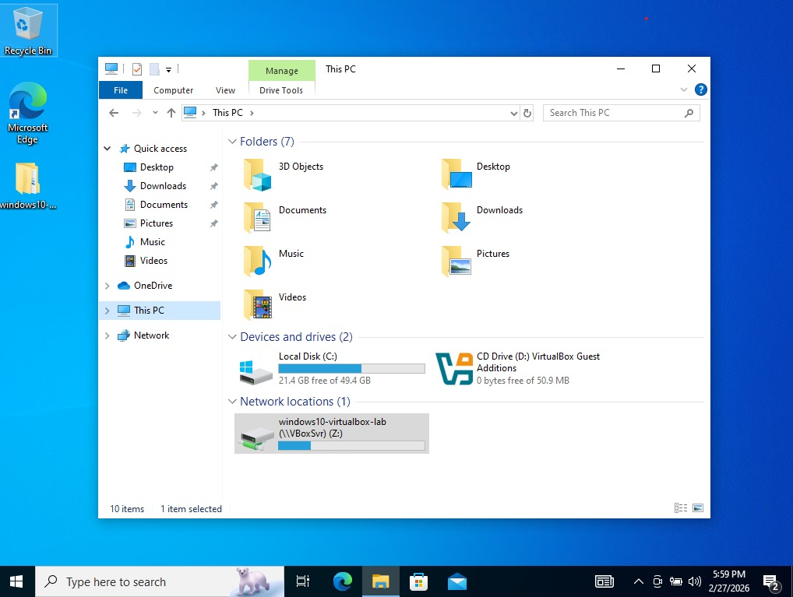
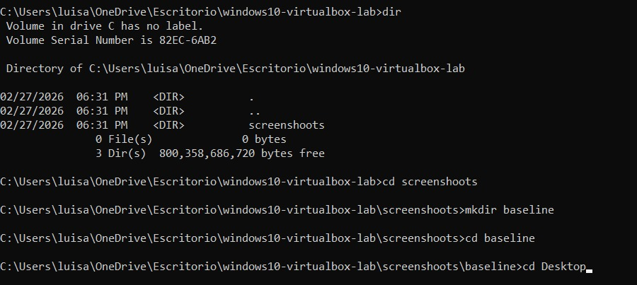

# Windows 10 VirtualBox Lab

## 1. Virtual Machine Configuration

The Windows 10 virtual machine was created in VirtualBox with the following configuration:

- RAM: 6144 MB
- CPU: 2 processors
- Guest OS: Windows 10 (64-bit)

## 2. Windows Installation 

Windows 10 was installed inside the VirtualBox virtual machine using the official Windows ISO image.

The system booted succesfully and the Windows desktop environment was accesible.

The screenshot below shows the completed Windows installation inside the virtual machine.

## 3. Shared Folder Configuration

A shared folder was configurated in VirtualBox to allow file exchange between the host system and the virtual machine.

The shared folder was mounted inside the virtual machine and appeared as drive Z:

The screenshot below shows the shared folder successfully mounted as drive Z: inside the virtual machine.

